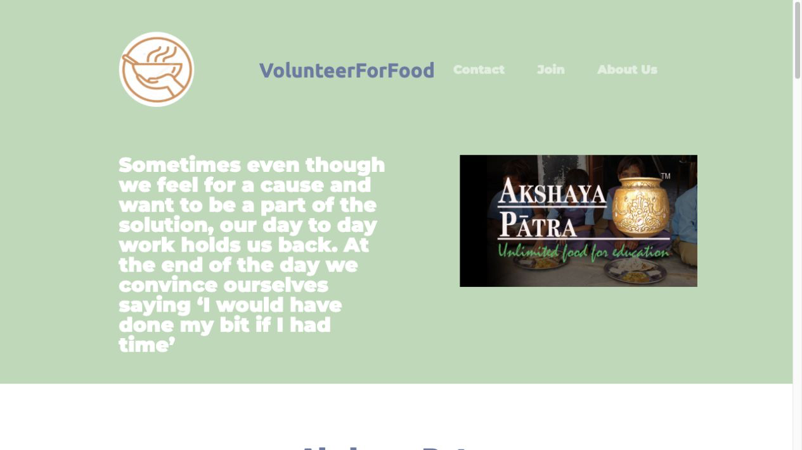
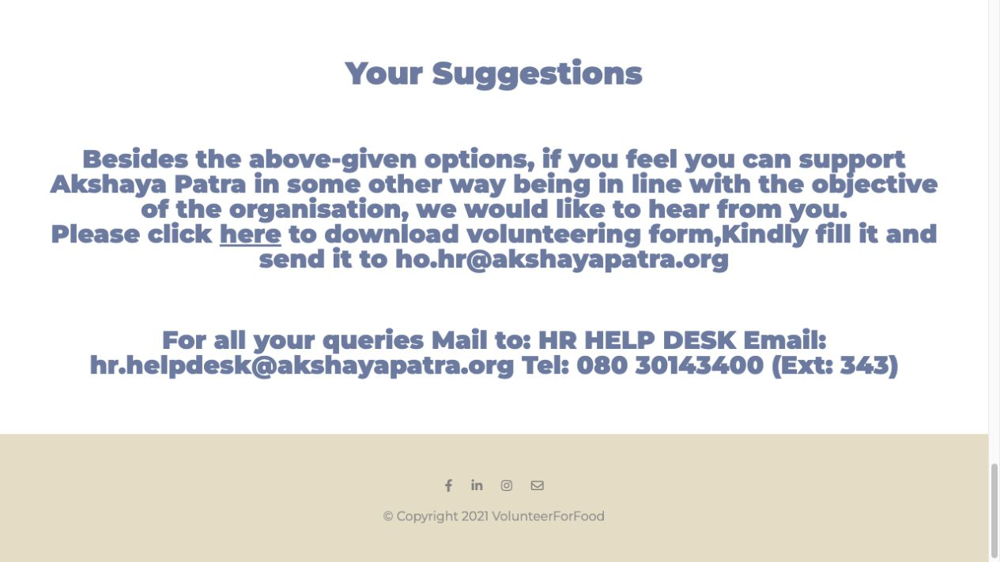
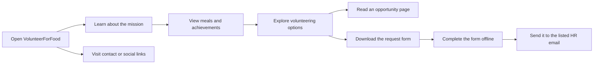
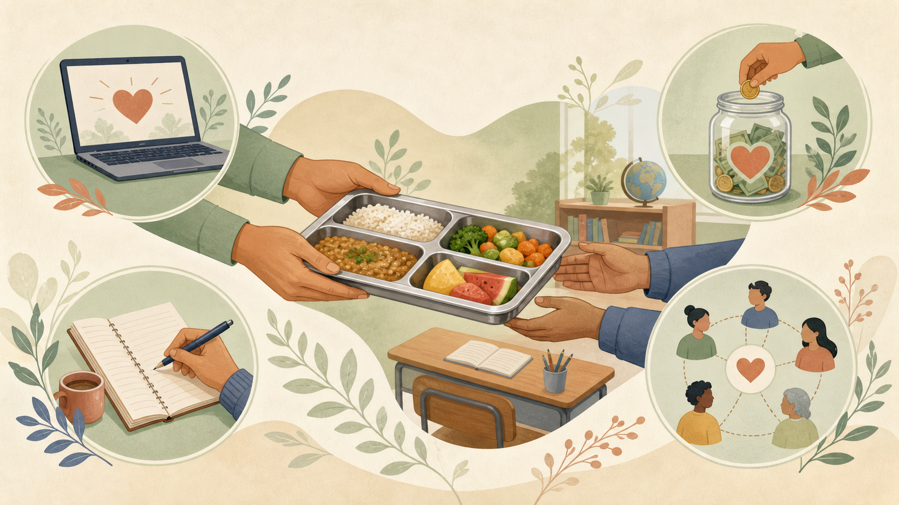

# VolunteerForFood

A volunteering-awareness website that introduces The Akshaya Patra Foundation's mission and ways people can support it.

## Disclaimer

This repository is presented as an educational front-end project. Organisation names, programme information, contact details, and external links are retained from the supplied source material. The repository does not state or imply official affiliation or endorsement.

  
  
  
  

## Overview

VolunteerForFood is a front-end informational website focused on food-support volunteering. It presents The Akshaya Patra Foundation's work, meal programme, recognitions, volunteering options, contact details, and a downloadable volunteering request form.

The project uses static HTML and CSS, with Bootstrap components supplied through a CDN. It does not include a database, login system, server-side processing, or an online form-submission backend.

## Preview

| Home page | Volunteer and contact section |
| --- | --- |
|  |  |

## What is included

- A landing page with navigation to the contact, volunteering, and about sections
- An introduction to The Akshaya Patra Foundation and its food programme
- Bootstrap carousels for meal photographs and organisational achievements
- Four volunteering-information pages:
  - Online Supporter
  - Blogging
  - Online Fundraising
  - Social Media
- A downloadable Microsoft Word volunteering request form
- Public contact information and links to the organisation's social pages
- Responsive styling for desktop and smaller screens

## Visitor journey

For a more detailed page map and technical view, see [docs/application-flow.md](docs/application-flow.md).

## Technology

| Area | Technology |
| --- | --- |
| Structure | HTML5 |
| Styling | CSS3 |
| Components and layout | Bootstrap 5.0.2 via CDN |
| Icons | Font Awesome 5.10 via CDN |
| Typography | Google Fonts: Montserrat and Ubuntu |
| Downloadable resource | Microsoft Word `.docx` form |

## Current limitations

- The website is an informational front-end project; it does not store user data.
- There is no authentication, administration dashboard, or database.
- The volunteer form is downloaded, completed offline, and sent using the contact information displayed on the site.
- Bootstrap, Font Awesome, and Google Fonts require internet access because they are loaded from external CDNs.
- Organisation details and contact information reflect the supplied repository snapshot and should be verified before a public deployment.

  

