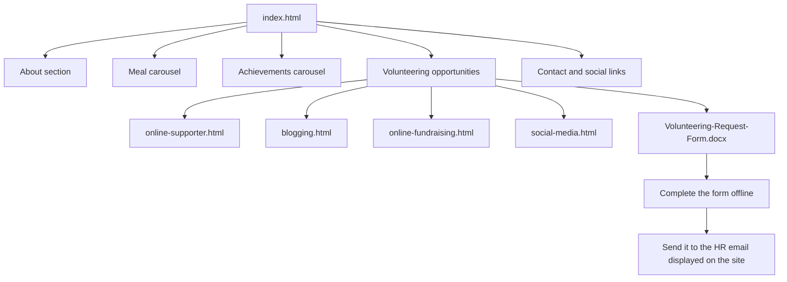
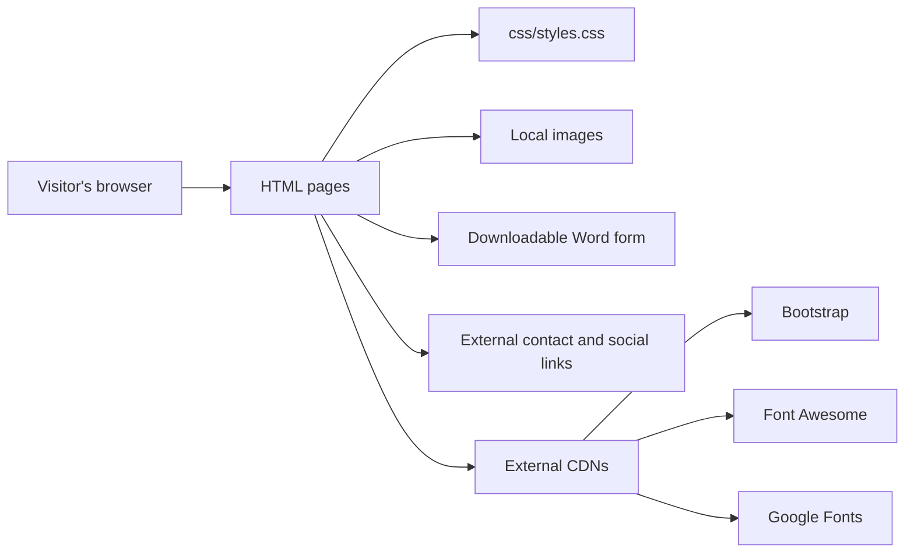

# VolunteerForFood — Application Flow

This document maps the pages and interactions already present in the supplied static website. It does not describe a backend, database, or submission service because those components are not part of the project.

## Visitor flow

## Static-site architecture

The browser reads the files directly from a static web host. The local CSS controls the site's palette, spacing, typography, imagery, and responsive behavior. Bootstrap supplies the navigation, grid, buttons, and carousel behavior.

## Page responsibilities

### Main page

`index.html` acts as the central route. It contains the main navigation, hero content, organisation introduction, meal and achievement carousels, opportunity links, form download, public contact details, and footer links.

### Opportunity pages

The four standalone HTML pages explain different ways to volunteer:

- `online-supporter.html` — online advocacy and sharing
- `blogging.html` — writing and blogging support
- `online-fundraising.html` — fundraising participation
- `social-media.html` — social-network engagement

These are informational pages. They do not collect or submit visitor data.

### Downloadable form

`Volunteering-Request-Form.docx` is linked from the main page using the browser's download behavior. The site instructs the visitor to complete it separately and send it to the displayed HR email address.

## Data and state

There is no application data model or persistent state in the repository:

- No database
- No API
- No authentication or user session
- No client-side data storage
- No online form processing

Navigation state and Bootstrap carousel movement exist only in the visitor's browser while the page is open.

## Deployment shape

The project can be hosted on any service capable of serving static files. All HTML files, the `css` directory, the `images` directory, and the Word form must retain their relative locations so existing links continue to work.
